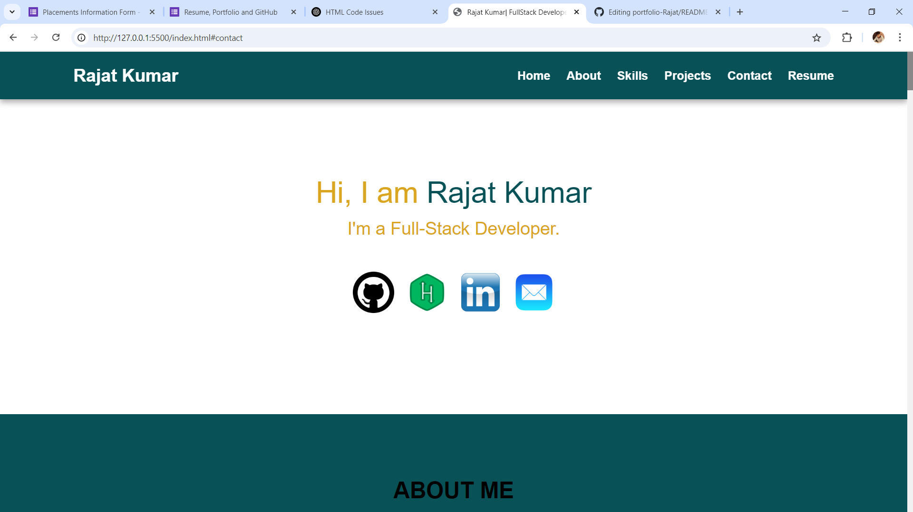
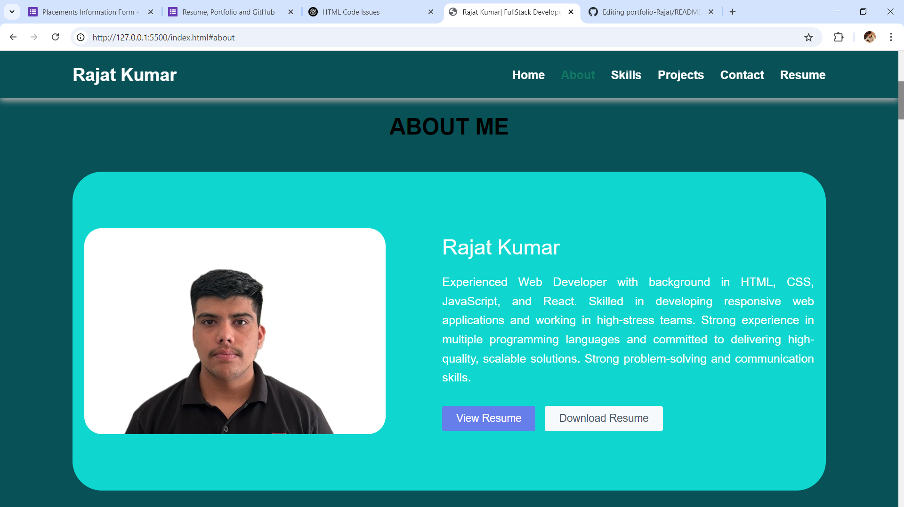
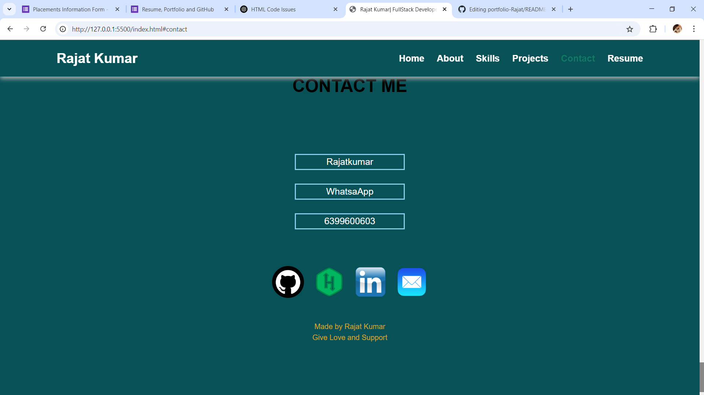

# 🌐 Portfolio - Rajat Kumar

Welcome to my personal portfolio website! This project showcases my skills, projects, and contact details. It's built using modern web technologies to create a smooth, interactive, and responsive user experience.

## 🚀 Live Preview
> [🔗 Visit My Portfolio](https://rajat2229.github.io/)  


---

## 📌 Tech Stack

- **Frontend:** HTML5, CSS3, JavaScript, Bootstrap 
- **Icons & Assets:** Font Awesome, JSON

---

## 📸 Sneak Peek

Here are a few screenshots of the main page:

| Home | About | Contact Me|
|------|-------|----------|
|  |  |  |

---

## 📁 Folder Structure
```bash
portfolio-Rajat/
├── assets/ # Images, screenshots, etc.
├── css/ # Stylesheets
├── js/ # JavaScript files
├── index.html # Main landing page
└── README.md # This file

---

## 🛠️ How to Use

1. **Clone the repository:**
   ```bash
   git clone https://github.com/rajat2229/portfolio-Rajat.git

---
## ✍️ Author
 Rajat Kumar
 B.Tech CSE @ Chitkara University
 🌍 From Shamli, Uttar Pradesh
 🔗 GitHub


